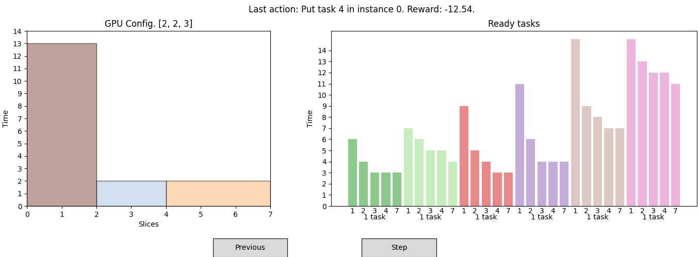

# Visualization tool
This tool allows to visualize the state and the decisions taken by an RL agent pre-trained with the Training tool, and to interact with it by requesting a new action to the agent or going back to the previous actions to observe the evolution of the state. Tasks are represented as rectangles in 2D (slices on the horizontal axis and time on the vertical axis).
## Configuration setup
The dependencies of this tool match those of the Training tool, so that the Python virtual environment created to run it can be reused. However, you can create and install the dependencies in the same way with the ``requirements.txt`` in this directory:

```bash
python -m venv venv
source venv/bin/activate  # If you are with Linux / macOS (.\venv\Scripts\activate   # If you are with Windows)
pip install -r requirements.txt
```
## Usage
La herramienta se ejecuta invocando al fichero ``evaluate.py`` y pasando como argumento la ruta al fichero con el modelo a evaluar mediante la opción ``--filename``:
```bash
python evaluate.py --filename ./trained_models/bs3_N=14_M=14_s=10000_wide_times.zip
```
It is very important that the file name respects the pattern with which it was created because, as can be seen, it contains the value of the different hyperparameters of the agent environment ($N$, $M$, number of timesteps $s$, type of workload such as wide_times...). The script takes these values by parsing the file name. The rest of the name can be modified as desired.
#### Output
The execution opens a window like the one shown below.



At each decision time step of the scheduler, it displays:
* **GPU State (left panel):** a 2D representation of the current allocation across GPU slices.
* **Batch Task State (right panel):** a canonical view of all pending tasks in the scheduler’s batch for that timestep.

Tasks are drawn as rectangles:

* **Horizontal axis:** GPU slices (from $S_1$ through $S_7$) and task instance sizes for the batch.
* **Vertical axis:** discretized duration of each task (time).

For a more detailed description of the model and this visualization, see Section 4 of the [paper]().

Below the GPU panel, you’ll find:

* **Current GPU configuration** (for example, in the above image current configuration is 2-2-3)
* **Batch composition**, grouped by task type (see Section 4.1 of the [paper]()), with the count of available tasks of each type. In the above image there are 6 types of tasks, with one task available of each type.

At the very top, a global title summarizes the agent’s most recent action (e.g. "put task 4 in instance 0") and the cumulative reward obtained so far (-12.54 in the example).

#### Interaction

Use the buttons at the bottom of the window to navigate through timesteps or advance the scheduler:

* `step`: Instructs the scheduler to make its next placement decision and updates the display to timestep $t+1$. Available only when the view is currently showing the latest executed timestep $t$.
* `previous`: Moves the display back to timestep $t-1$. Always enabled unless you are already at $t=0$.
* `next`: Moves the display forward to the next timestep (e.g. from $t-1$ to $t$). Only enabled when you are not already viewing the latest timestep—otherwise, use “step” to advance.
